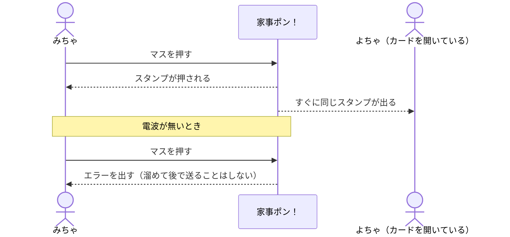

# システム要件

書き途中。

## スタンプの同期

```mermaid
sequenceDiagram
  actor A as みちゃ
  participant S as 家事ポン！
  actor B as よちゃ（カードを開いている）

  A->>S: マスを押す
  S-->>A: スタンプが押される
  S-->>B: すぐに同じスタンプが出る

  Note over A,S: 電波が無いとき
  A->>S: マスを押す
  S-->>A: エラーを出す（溜めて後で送ることはしない）
```

## これから決めること

- 使う技術（言語、フレームワーク、データの置き場所）
- どこに公開するか
- PWA の作り方
- 押した日をどの時計で決めるか（スマホの時計がずれていても、日付を正しく区切るため）
- 0 時をまたいだとき、開いたままのカードをどうやってまっさらにするか
